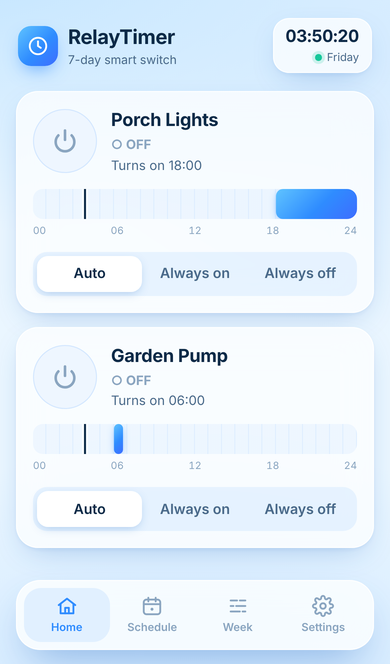
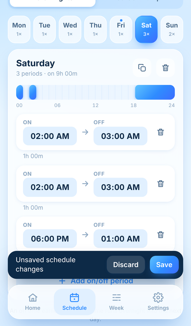
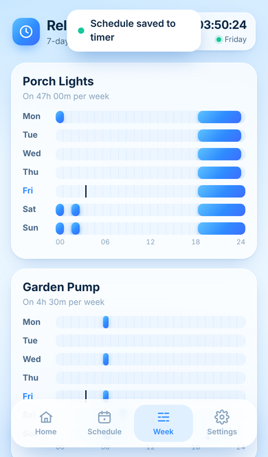
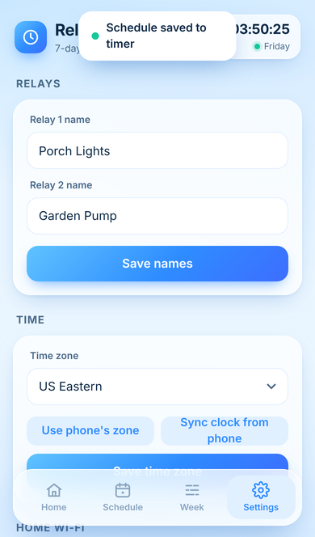

# RelayTimer — 7-day Wi-Fi timer for an ESP32-C3 2-relay module

Firmware that turns an ESP32-C3 dual-relay board into a weekly timer switch.
The board serves its own phone-friendly web app (light-blue, glassy, bottom tab
bar), so any iPhone or Android phone can set it up in a browser — no app to
install.

<p>
 
 
</p>

## Features

- **Two relays, seven days, independent schedules.** Each day can have up to
  8 on/off periods per relay. A period whose off time is earlier than its on
  time runs overnight (e.g. 22:00 → 06:00).
- **Home:** live state of each relay, a 24-hour timeline for today with a
  "now" marker, the next switching time, and an Auto / Always on / Always off
  override.
- **Schedule:** pick a relay and a day, edit periods with native time
  pickers, copy a day to weekdays / weekend / all days (and optionally to the
  other relay). Changes are saved to the board only when you tap **Save**.
- **Week:** an at-a-glance 7-day chart per relay; tap a day to edit it.
- **Settings:** relay names, time zone, clock sync from your phone, home Wi-Fi
  (with network scan), hotspot password.
- Everything is stored in flash and survives power cuts.

## Why Wi-Fi rather than Bluetooth

iPhones can't talk to Bluetooth devices from a web page (Safari has no Web
Bluetooth), so a Bluetooth version would need a native app. Wi-Fi works from
any phone's browser, and the board makes its own hotspot so you don't need a
router.

## What you need

- An ESP32-C3 2-channel relay module (or an ESP32-C3 board plus a 2-channel
  relay board).
- Arduino IDE 2.x with the **esp32 by Espressif** boards package (v3.x)
  and the **ArduinoJson** library (v7) from the Library Manager.

## Set up and flash

1. Open `RelayTimer/RelayTimer.ino` in the Arduino IDE.
2. At the top of the sketch, set the relay pins for your board:

   ```cpp
   static const uint8_t RELAY_PINS[2] = {0, 1};
   static const bool RELAY_ACTIVE_HIGH = true;
   ```

   Relay GPIOs vary between modules, so check the silkscreen or the seller's
   pin list. If a relay is on when the app says off, set
   `RELAY_ACTIVE_HIGH` to `false`. Avoid GPIO 18/19 (USB), and GPIO 2, 8, 9
   (boot strapping) unless the board already uses them for the relays.
3. Optionally change `DEFAULT_TZ` and `AP_DEFAULT_PASS`.
4. **Tools → Board → ESP32C3 Dev Module**, enable **USB CDC On Boot** if your
   board uses native USB, select the port, and upload.

The Serial Monitor (115200 baud) prints the hotspot name and password.

## Use it from your phone

1. On your phone, join Wi-Fi **RelayTimer-XXXX** (password `relay1234` unless
   you changed it). The app usually opens by itself; if not, browse to
   **http://192.168.4.1**.
2. The board has no battery-backed clock, so the app sets its clock from your
   phone the first time it connects (you can also tap **Sync** at any time).
3. Under **Settings → Time zone**, tap **Use phone's zone** and **Save**.
4. Build the schedule under **Schedule** and tap **Save**.
5. *(Recommended)* Under **Settings → Home Wi-Fi**, scan, choose your network
   and tap **Connect**. The timer then:
   - keeps exact time from the internet (and recovers it after a power cut),
   - can be reached on your home network at **http://relaytimer.local**
     (Android may need the IP shown in Settings instead).

   The hotspot stays on either way.

> **Power cuts without home Wi-Fi:** the clock is lost when power drops. Until
> you open the app again (which re-syncs it), relays in **Auto** stay off.
> Joining home Wi-Fi avoids this.

## How the schedule works

- Days use the board's local time in the selected time zone (DST handled by
  the POSIX TZ rule).
- At any minute a relay in **Auto** is on if the minute falls inside any of
  that day's periods, or inside the overnight tail of the previous day's.
- **Always on / Always off** ignore the schedule until you go back to
  **Auto**. The choice is remembered across restarts.

## Editing the web app

The page lives in `web/index.html`. After changing it, regenerate the header
that gets compiled into the firmware:

```sh
python3 tools/embed_html.py
```

To work on the UI without hardware, run a fake timer and open
http://localhost:8000 in a browser (use the phone emulator in dev tools):

```sh
python3 tools/mock_server.py
```

## HTTP API

| Method | Path            | Body / result |
|--------|-----------------|---------------|
| GET    | `/api/state`    | clock, relay names / modes / on-off |
| GET    | `/api/schedule` | `{"maxSlots":8,"relays":[[ [[on,off],…] ×7 days ] ×2]}` — minutes after midnight, day 0 = Sunday |
| POST   | `/api/schedule` | same shape as GET; replaces the whole schedule |
| POST   | `/api/relay`    | `{"relay":0,"mode":"auto"\|"on"\|"off"}` |
| POST   | `/api/time`     | `{"epoch":1760000000}` sets the clock |
| GET/POST | `/api/settings` | `names`, `tz`, `ssid`, `pass`, `apPass` |
| GET    | `/api/scan`     | nearby Wi-Fi networks |

## Troubleshooting

- **Hotspot drops every few seconds:** the board is trying to join a home
  network it can't reach (Wi-Fi shares one radio and channel). Fix the name or
  password, or clear the network name in Settings and tap Connect.
- **Relays click the wrong way round:** flip `RELAY_ACTIVE_HIGH`.
- **Nothing switches in Auto:** check the clock in the top-right corner of the
  app. If it says "Clock not set", tap **Sync**.
